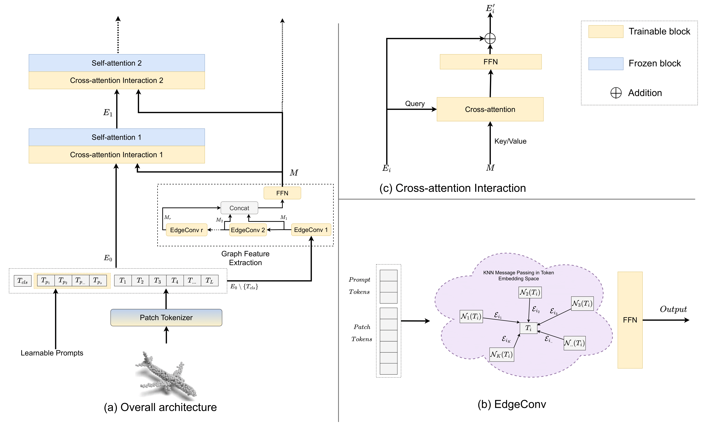
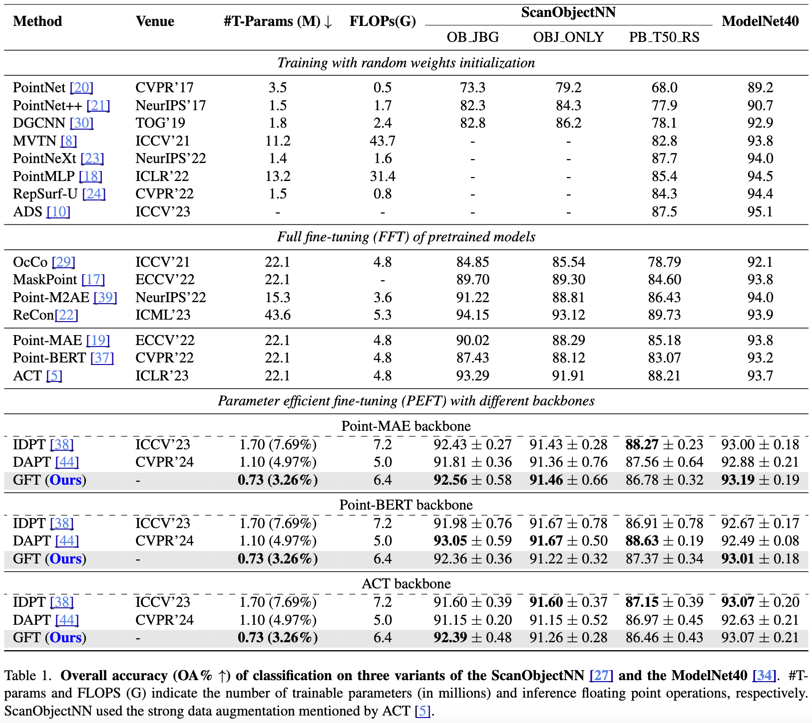

# GFT: Graph Feature Tuning for Efficient Point Cloud Analysis

Accepted at: [WACV 2026](https://wacv.thecvf.com/)

ArXiv: [arxiv:2511.10799](https://arxiv.org/abs/2511.10799)

## Abstract
Parameter-efficient fine-tuning (PEFT) significantly reduces computational and memory costs by updating only a small subset of the model's parameters, enabling faster adaptation to new tasks with minimal loss in performance. Previous studies have introduced PEFTs tailored for point cloud data, as general approaches are suboptimal. To further reduce the number of trainable parameters, we propose a point-cloud-specific PEFT, termed Graph Features Tuning (GFT), which learns a dynamic graph from initial tokenized inputs of the transformer using a lightweight graph convolution network and passes these graph features to deeper layers via skip connections and efficient cross-attention modules. Extensive experiments on object classification and segmentation tasks show that GFT operates in the same domain, rivalling existing methods, while reducing the trainable parameters. 

## Table of Contents
- [Methodology](#methodology)
- [Setup](#setup)
- [Finetuning](#finetuning)
- [Results](#results)

## Methodology
<div style="text-align: center;">
  
</div>

## Setup

### Environment Setup
Please refer to the [IDPT](https://github.com/zyh16143998882/ICCV23-IDPT) repo for environment setup.

Script for additional libraries:
```bash
pip install -r requirements.txt
```

**Note:** If there are any missing libraries, please install accordingly.

### Pretrained Model Setup
Download pretrained models from:

| Pretrained Model  | Link          |
|-------------------|-------------------|
| ACT             | [here](https://drive.google.com/file/d/1T8bzdJfzdfQtCLu3WU9yDZTgBrLXSDcE/view?usp=drive_link)      |
| Point-BERT      | [here](https://cloud.tsinghua.edu.cn/f/202b29805eea45d7be92/?dl=1)      |
| Point-MAE         | [here](https://github.com/Pang-Yatian/Point-MAE/releases/download/main/pretrain.pth)      |

Save those models to follow the structure given below:
```plaintext
pretrained/
├── ACT/
│   └── pretrained.pth
├── Point-BERT/
│   └── pretrained.pth
└── Point-MAE/
    └── pretrained.pth
```

### Dataset Setup
Please follow the instructions from [DATASET.md](DATASET.md).

## Finetuning

### Baselines
Baselines are reproduced from [DAPT](https://github.com/LMD0311/DAPT) and [IDPT](https://github.com/zyh16143998882/ICCV23-IDPT) with stronger augmentation strategy of [ACT](https://github.com/RunpeiDong/ACT).

### Ours

All of the training scripts for classification and segmentation are in the `scripts/` directory.

Eg. script for reproduding all of the results from OBJ_BG for Point-MAE checkpoint:
```sh
bash scripts/objbg.sh
```

Change the configs from the scripts to run experiments with other pretrained `---ckpts` and `--exp_name` can be any name for your log directory. Seeds are integers ranged within `[0,9]`. 

OR, run the command given below with needed changes.

```bash
CUDA_VISIBLE_DEVICES=0 \
python main.py \
--config cfgs/gft/finetune_scan_objbg.yaml \
--ckpts pretrained/Point-MAE/pretrained.pth \
--finetune_model \
--exp_name point_mae \ 
--seed 0
```

## Results
<div style="text-align: center;">
  
</div>

## BibTeX Citation
```
@inproceedings{dhakal2026gft,
  title = {GFT: Graph Feature Tuning for Efficient Point Cloud Analysis},
  author = {Dhakal, Manish and Dasari, Venkat R. and Sunderraman, Raj and Ding, Yi},
  booktitle = {Proceedings of the  Winter Conference on Applications of Computer Vision (WACV)},
  month = {March},
  year = {2026},
}
```

## Acknowledgement
Many thanks to the following repositories that helped with an established training pipeline and other utility codes: [DAPT](https://github.com/LMD0311/DAPT) and [IDPT](https://github.com/zyh16143998882/ICCV23-IDPT), [Point-BERT](https://github.com/Julie-tang00/Point-BERT), [Point-MAE](https://github.com/Pang-Yatian/Point-MAE), [ACT](https://github.com/RunpeiDong/ACT), and [Pointnet2_PyTorch](https://github.com/erikwijmans/Pointnet2_PyTorch).